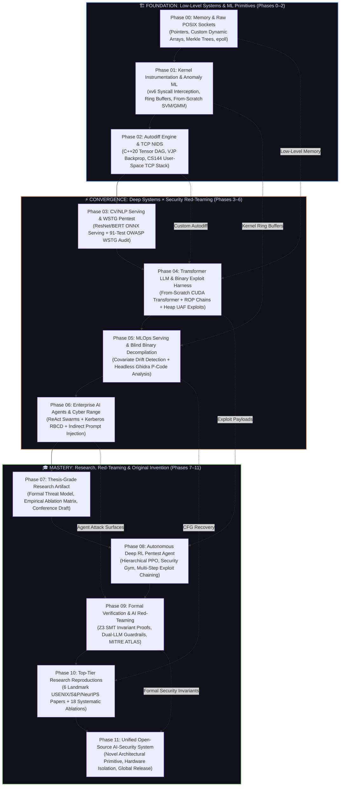

# Master Execution Roadmap
## AI Systems Engineering × Offensive Security | 2026–2030

[](https://isocpp.org/std/the-standard)
[](https://www.python.org/downloads/release/python-3120/)
[](https://learn.microsoft.com/windows/wsl/)
[](https://opensource.org/licenses/MIT)
[](https://developer.nvidia.com/cuda-zone)
[](#-master-execution-table)
[](#-the-s-protocol-spec)

---

## 🎯 Mission Statement

Forge dual-domain mastery across AI Systems Engineering and Offensive Security through a rigorous 4-year (2026–2030) execution trajectory that mandates mathematical derivation, zero-wrapper systems implementation, adversarial break-and-patch cycles, and publishable documentation at every phase. The ultimate terminal objective is to design, prove, benchmark, and deploy a unified, production-grade open-source AI-Security system solving an unaddressed vulnerability class in autonomous systems.

---

## 🔗 System Convergence Architecture

The following architecture diagram demonstrates how low-level systems (C/kernel internals), machine learning engines (autodiff, transformers, RL), and red-team exploitation frameworks interlock into an unified security engineering continuum.



---

## 📋 Master Execution Table

| # | Phase Name & Project | Timeline | Stack | Compute Tier Budget | Status | Phase Hub |
|---|----------------------|----------|-------|---------------------|:------:|:---------:|
| **00** | [Phase 00: Recall Sprint](Roadmap_Execution/Phase_00_Recall_Sprint/)<br><sub>*Secure Systems Utility Suite*</sub> | Sep 12–27, 2026<br>*(16 Days)* | `C17`, `x86_64 asm`, `POSIX`, `GDB`, `Valgrind` | Local CPU / WSL2<br>**$0** | 🟡 `IN PROGRESS` | [Explore](Roadmap_Execution/Phase_00_Recall_Sprint/) |
| **01** | [Phase 01: Semester 5 Fusion](Roadmap_Execution/Phase_01_Semester_5_Fusion/)<br><sub>*AI-Driven OS-Level Security Monitor*</sub> | Sep 28, 2026 – Jan 2027<br>*(16 Weeks)* | `C`, `RISC-V asm`, `Python`, `xv6`, `QEMU` | Local CPU + Codespaces<br>**$0–10/mo** | ⚪ `QUEUED` | [Explore](Roadmap_Execution/Phase_01_Semester_5_Fusion/) |
| **02** | [Phase 02: Systems + Deep Learning](Roadmap_Execution/Phase_02_Systems_Deep_Learning/)<br><sub>*Autodiff Framework & TCP NIDS*</sub> | Feb – Apr 2027<br>*(12 Weeks)* | `C++20`, `Python`, `SIMD`, `TUN/TAP`, `Wireshark` | Local CPU + Colab Free<br>**$0–20/mo** | ⚪ `QUEUED` | [Explore](Roadmap_Execution/Phase_02_Systems_Deep_Learning/) |
| **03** | [Phase 03: CV/NLP + Web Security](Roadmap_Execution/Phase_03_CV_NLP_Web_Security/)<br><sub>*Self-Audited CV/NLP Web Application*</sub> | May – Jul 2027<br>*(12 Weeks)* | `PyTorch`, `ONNX`, `FastAPI`, `React`, `Docker` | GPU-Lite / Colab Pro<br>**$20–40/mo** | ⚪ `QUEUED` | [Explore](Roadmap_Execution/Phase_03_CV_NLP_Web_Security/) |
| **04** | [Phase 04: LLM + Binary Exploitation](Roadmap_Execution/Phase_04_LLM_Binary_Exploitation/)<br><sub>*Transformer LLM & Binary Exploit Harness*</sub> | Aug – Oct 2027<br>*(12 Weeks)* | `C++`, `CUDA`, `Rust`, `x86_64 ROP`, `pwndbg` | Cloud GPU (A100/4090)<br>**$100–250/mo** | ⚪ `QUEUED` | [Explore](Roadmap_Execution/Phase_04_LLM_Binary_Exploitation/) |
| **05** | [Phase 05: MLOps + Reverse Engineering](Roadmap_Execution/Phase_05_MLOps_Reverse_Engineering/)<br><sub>*MLOps Serving Platform & Binary Audit*</sub> | Nov 2027 – Jan 2028<br>*(12 Weeks)* | `Go`, `Rust`, `Python`, `Ghidra P-Code`, `Docker` | 32GB RAM Cloud VM<br>**$20–50/mo** | ⚪ `QUEUED` | [Explore](Roadmap_Execution/Phase_05_MLOps_Reverse_Engineering/) |
| **06** | [Phase 06: Agents + Enterprise Security](Roadmap_Execution/Phase_06_Agents_Enterprise_Security/)<br><sub>*Enterprise AI Agent Security Lab*</sub> | Feb – Apr 2028<br>*(12 Weeks)* | `Python`, `TypeScript`, `PowerShell`, `Active Directory` | Cloud Multi-VM Cluster<br>**$30–60/mo** | ⚪ `QUEUED` | [Explore](Roadmap_Execution/Phase_06_Agents_Enterprise_Security/) |
| **07** | [Phase 07: FYP Integration](Roadmap_Execution/Phase_07_FYP_Integration/)<br><sub>*Thesis-Grade Research Artifact*</sub> | May – Jun 2028<br>*(8 Weeks)* | `C++`, `Python`, `Rust`, `LaTeX`, `IEEE/ACM` | Local + University<br>**$0–50/mo** | ⚪ `QUEUED` | [Explore](Roadmap_Execution/Phase_07_FYP_Integration/) |
| **08** | [Phase 08: RL + Autonomous Security Agent](Roadmap_Execution/Phase_08_RL_Autonomous_Security_Agent/)<br><sub>*Deep RL Autonomous Pentest Agent*</sub> | Jul – Dec 2028<br>*(24 Weeks)* | `Python`, `PyTorch`, `Ray`, `Gymnasium`, `Docker` | Cloud GPU (A100 Cluster)<br>**$100–200/mo** | ⚪ `QUEUED` | [Explore](Roadmap_Execution/Phase_08_RL_Autonomous_Security_Agent/) |
| **09** | [Phase 09: Formal Security + AI Red-Team](Roadmap_Execution/Phase_09_Formal_Security_AI_RedTeam/)<br><sub>*AI Red-Team Lab & Secure RAG*</sub> | Jan – Jun 2029<br>*(24 Weeks)* | `Python`, `Z3 SMT`, `Dafny`, `MITRE ATLAS` | Local + Cloud Burst<br>**$50–100/mo** | ⚪ `QUEUED` | [Explore](Roadmap_Execution/Phase_09_Formal_Security_AI_RedTeam/) |
| **10** | [Phase 10: Research Reproductions](Roadmap_Execution/Phase_10_Research_Reproductions/)<br><sub>*6 Top-Tier Paper Reproductions*</sub> | Jul – Dec 2029<br>*(24 Weeks)* | `Python`, `CUDA`, `C++`, `Docker`, `Ablation Harness` | Cloud GPU Variable<br>**$100–300/mo** | ⚪ `QUEUED` | [Explore](Roadmap_Execution/Phase_10_Research_Reproductions/) |
| **11** | [Phase 11: Original Invention](Roadmap_Execution/Phase_11_Original_Invention/)<br><sub>*Unified Open-Source AI-Security System*</sub> | Jan – Sep 2030<br>*(36 Weeks)* | `C++`, `Rust`, `CUDA`, `Formal Methods`, `Enclaves` | Scaled Cloud GPU<br>**$100–300/mo** | ⚪ `QUEUED` | [Explore](Roadmap_Execution/Phase_11_Original_Invention/) |

---

## 🛡 The Protocol Spec

The **S++++++ Standard** is a rigorous 6-stage engineering verification protocol. No phase or flagship milestone is marked complete based on passive consumption, tutorial completion, or surface-level wrappers. Every project must execute the following sequential exit pipeline:

```
┌────────────────────────────────────────────────────────────────────────────────────────┐
│                               THE S++++++ PROTOCOL SPEC                                │
└────────────────────────────────────────────────────────────────────────────────────────┘
  [1. DERIVE]   ──▶ Reconstruct all underlying mathematics & systems theory from scratch
  [2. IMPLEMENT]──▶ Write zero-wrapper native code (C, C++20, CUDA, raw syscalls)
  [3. BENCHMARK]──▶ Profile quantitatively against standard baselines (NumPy, kernel, CVEs)
  [4. BREAK]    ──▶ Inject intentional CWEs / execute adversarial ML evasion & ROP chains
  [5. PATCH]    ──▶ Remediate vulnerabilities, harden build flags & verify with AFL++/GDB
  [6. DOCUMENT] ──▶ Author auditable 40+ page technical report with mathematical proofs
```

### Formal Stage Breakdown

1. **Stage 1: Derive (Mathematical Foundations)**
   * Derive all mathematical formulations, loss functions, tensor Jacobians, statistical tests, or cryptographic invariants on paper prior to writing code.
   * Document formal proofs in `DERIVATION.md` using rigorous LaTeX notation.

2. **Stage 2: Implement (Zero Wrappers)**
   * Construct all core components from first principles with zero high-level framework wrappers.
   * Strict adherence to native compilers and flags: `-Wall -Wextra -Wpedantic -Werror -O2 -g3`.

3. **Stage 3: Benchmark (Empirical Baselines)**
   * Measure throughput, latency profiles ($p50, p95, p99$), memory footprints, and classification/detection metrics against industry-standard baselines (e.g., OpenBLAS, Linux TCP stack, Scikit-Learn, Snort/Suricata, Burp Scanner).
   * Confirm that all targets meet or exceed established performance thresholds.

4. **Stage 4: Break (Adversarial Stress Testing)**
   * Subject the codebase to aggressive adversarial exploitation: inject memory corruption primitives (CWE-121 stack overflows, CWE-416 UAF, race conditions), craft adversarial perturbation tensors (FGSM, PGD, GCG prompt injections), and execute end-to-end exploit chains.
   * Record memory states, registers, and interactive GDB/pwndbg debugging traces.

5. **Stage 5: Patch (Hardening & Remediation)**
   * Remediate all injected vulnerabilities using memory bounds validation, atomic locks, strict capability tokens, or adversarial retraining.
   * Apply compiler and runtime mitigations: `-fstack-protector-strong -D_FORTIFY_SOURCE=2 -fcf-protection=full -pie -Wl,-z,relro,-z,now` alongside AddressSanitizer/UBSan.
   * Run 24-hour fuzzing harness (AFL++ / libFuzzer) to confirm zero crashes and zero memory leaks.

6. **Stage 6: Document (Auditable Artifact)**
   * Compile a comprehensive, reproducible technical audit report detailing architecture blueprints, formal mathematical derivations, benchmark matrices, exploit PoCs, and remediation diffs.
   * Tag the repository with the corresponding signed release version (e.g., `v0.6-audit-complete`).

---

## 💰 4-Year Compute & Hardware Budget

| Period | Phases | Monthly Budget | Target Hardware / Platform | Purpose & Critical Constraints |
|:-------|:-------|:--------------:|:--------------------------|:-------------------------------|
| **Year 1 (2026–27)** | Phases 00–02 | **$0 – $20** | Local CPU (WSL2) + Google Colab Free | C/C++ systems foundation, xv6 kernel, C++20 autodiff |
| **Year 1 (Summer 2027)** | Phase 03 | **$20 – $40** | Colab Pro / GitHub Codespaces GPU | CV/NLP fine-tuning, ONNX serving, WSTG pentesting |
| **Year 2 (2027–28)** | Phase 04 | **$100 – $250** | RunPod / Lambda (4× A100 80GB / RTX 4090) | From-scratch GPT pretraining (10B tokens) & CUDA kernels |
| **Year 2 (2027–28)** | Phase 05 | **$20 – $50** | 32GB RAM Cloud VM (Ubuntu 24.04) | **RAM Alert:** 8GB local memory will thrash Ghidra + Docker |
| **Year 2 (Spring 2028)** | Phase 06 | **$30 – $60** | Multi-VM Cloud Cluster (DC + Workstations) | Active Directory cyber range & ReAct agent red-teaming |
| **Year 2 (Summer 2028)** | Phase 07 | **$0 – $50** | Local Host + University Compute | Final Year Project research artifact & thesis defense |
| **Year 3 (2028–29)** | Phase 08 | **$100 – $200** | Cloud GPU (RTX 4090 / A100) | Hierarchical Deep RL policy rollouts in Security Gym |
| **Year 3 (2029)** | Phase 09 | **$50 – $100** | Local Host + GPU Cloud Burst | Z3 formal proofs, differential privacy, red-team labs |
| **Year 4 (2029–30)** | Phase 10 | **$100 – $300** | Scaled Cloud GPU Instances | 6 top-tier paper reproductions & 18 ablation studies |
| **Year 4 (2030)** | Phase 11 | **$100 – $300** | Scaled Cloud GPU + Enclave Infrastructure | Final unified AI-Security system & conference publication |

---

## 🎓 Verified Credentials & Certifications Directory

| Certification / Credential | Authority | Cost | Access & Verification Pathway |
|:---------------------------|:---------:|:----:|:------------------------------|
| **CS50x Computer Science Verified Certificate** | HarvardX | **$0** | Complete all problem sets with $\ge 70\%$ score on [edX CS50x](https://learning.edx.org/course/course-v1:HarvardX+CS50+X/). |
| **Deep Learning Specialization** | DeepLearning.AI | **$0** | Apply via Coursera Financial Aid on [Coursera Deep Learning](https://www.coursera.org/specializations/deep-learning). |
| **Hugging Face Agents Course Certification** | Hugging Face | **$0** | Complete quizzes and hands-on evaluation at [HF Agents Course](https://huggingface.co/learn/agents-course). |
| **pwn.college Dojo Cyber Badges** | ASU / pwn.college | **$0** | Complete challenge modules on [pwn.college](https://dojo.pwn.college/). |
| **MITRE ATT&CK & ATLAS Training** | MITRE Corporation | **$0** | Complete official curriculum at [MITRE Training](https://attack.mitre.org/resources/training/). |
| **Windows Security & AD Learning Paths** | Microsoft Learn | **$0** | Interactive badges for AD, Sysinternals, and Kerberos on [Microsoft Learn](https://learn.microsoft.com/). |
| **PortSwigger Web Security Public Profile** | PortSwigger | **$0** | 100% completion profile on [PortSwigger Web Security Academy](https://portswigger.net/web-security). |

---

## 📁 Repository Directory Structure

```
.
├── .gitignore                                      # Strict build/binary artifact exclusion
├── LICENSE                                         # MIT Open Source License
├── README.md                                       # Master Execution Hub & Architectural Blueprint
└── Roadmap_Execution/                              # Core execution workspaces
    ├── README.md                                   # Execution index & global progress tracker
    ├── Phase_00_Recall_Sprint/                     # Phase 00: Secure Systems Utility Suite
    │   ├── README.md
    │   └── Courses/resources.md
    ├── Phase_01_Semester_5_Fusion/                 # Phase 01: AI-Driven OS-Level Security Monitor
    │   ├── README.md
    │   └── Courses/resources.md
    ├── Phase_02_Systems_Deep_Learning/             # Phase 02: Autodiff Engine & TCP NIDS
    │   ├── README.md
    │   └── Courses/resources.md
    ├── Phase_03_CV_NLP_Web_Security/               # Phase 03: Audited CV/NLP Web App
    │   ├── README.md
    │   └── Courses/resources.md
    ├── Phase_04_LLM_Binary_Exploitation/           # Phase 04: Transformer LLM & Binary Exploit Harness
    │   ├── README.md
    │   └── Courses/resources.md
    ├── Phase_05_MLOps_Reverse_Engineering/         # Phase 05: MLOps Platform & Ghidra Binary Audit
    │   ├── README.md
    │   └── Courses/resources.md
    ├── Phase_06_Agents_Enterprise_Security/        # Phase 06: Enterprise AI Agent Security Lab
    │   ├── README.md
    │   └── Courses/resources.md
    ├── Phase_07_FYP_Integration/                   # Phase 07: Thesis-Grade Research Artifact
    │   ├── README.md
    │   └── Courses/resources.md
    ├── Phase_08_RL_Autonomous_Security_Agent/      # Phase 08: Deep RL Pentest Agent
    │   ├── README.md
    │   └── Courses/resources.md
    ├── Phase_09_Formal_Security_AI_RedTeam/        # Phase 09: Formal Security & AI Red-Team Lab
    │   ├── README.md
    │   └── Courses/resources.md
    ├── Phase_10_Research_Reproductions/            # Phase 10: 6 Landmark Paper Reproductions
    │   ├── README.md
    │   └── Courses/resources.md
    └── Phase_11_Original_Invention/                # Phase 11: Unified Open-Source AI-Security System
        ├── README.md
        └── Courses/resources.md
```

---

## ⚡ Day 1 Execution Protocol (Phase 00 Quick Start)

To initiate Day 1 of **Phase 00: Recall Sprint**, initialize the local environment and compile the first memory micro-program:

```bash
# 1. Navigate to Phase 00 directory
cd Roadmap_Execution/Phase_00_Recall_Sprint/

# 2. Create the project directory layout
mkdir -p Project_Utility_Suite/src Project_Utility_Suite/tests/micro Project_Utility_Suite/docs

# 3. Compile dynamic array micro-program with strict pedantic flags
gcc -std=c17 -Wall -Wextra -Wpedantic -Werror -g3 \
    Project_Utility_Suite/tests/micro/dynamic_array.c -o dynamic_array

# 4. Enforce the Zero-Leak Valgrind Gate
valgrind --leak-check=full \
         --show-leak-kinds=all \
         --track-origins=yes \
         --error-exitcode=1 \
         ./dynamic_array
```

---

## 📜 License

This repository and all associated research code are released under the [MIT License](LICENSE).

```
Copyright (c) 2026 S++++++ Master Execution Roadmap Authors
```
